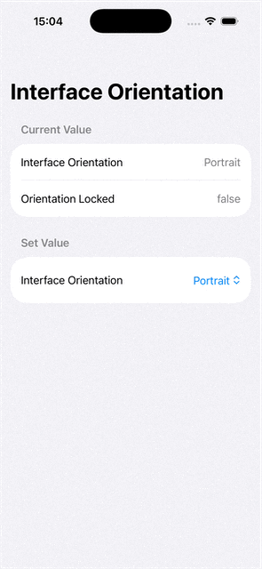

# SwiftUI_GetSetObserveInterfaceOrientation

Get and set UIInterfaceOrientation (not UIDeviceOrientation), as well as watch for changes.

For more details, please refer to my article: [SwiftUI: Get & Set & Watch Interface Orientation & Orientation Lock](https://medium.com/@itsuki.enjoy/little-swiftui-tip-get-set-watch-interface-orientation-orientation-lock-5076a0923c14)

